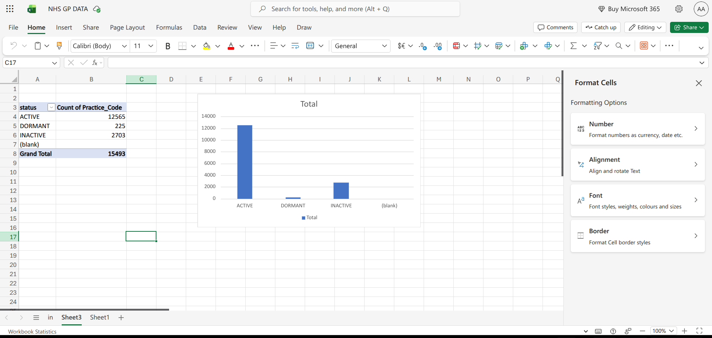
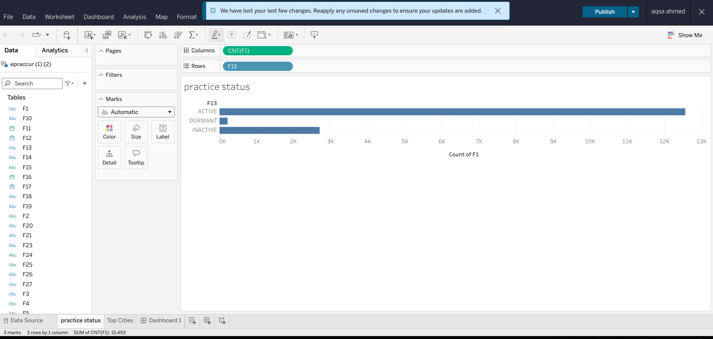
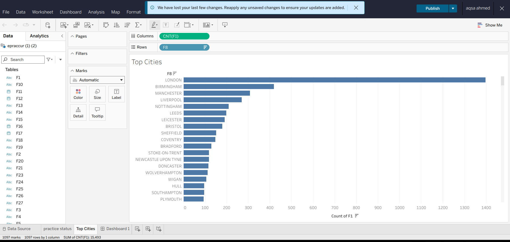

# NHS GP Practice Analysis

## Project Overview
This project analyses NHS GP practice organisation data to understand practice status and city-level distribution.

The aim was to answer:
- How many GP practices are active, inactive, or dormant?
- Which cities have the highest number of GP practices?
- What do these patterns suggest about service distribution?

## Tools Used
- Python / Pandas
- Excel Pivot Tables
- Tableau Public
- Data Cleaning
- Data Visualisation

## Key Findings
- The dataset contains 15,493 GP practice records.
- 12,565 practices are active.
- 2,703 practices are inactive.
- 225 practices are dormant.
- London has the highest number of GP practice records, followed by Birmingham and Manchester.
- GP practices are concentrated in major cities, which may reflect population density and demand for primary care services.

## Dashboard
Tableau Public dashboard: https://public.tableau.com/authoring/NHSGPPracticeAnalysisDashboard/Dashboard1#1

## Limitations
This dataset is organisation-level NHS GP practice data. It does not include patient list size, appointment demand, workforce numbers, waiting times, or quality of care measures.

## Skills Demonstrated
- Loading and cleaning NHS CSV data
- Selecting relevant fields for analysis
- Creating pivot tables in Excel
- Building Tableau visualisations
- Summarising healthcare data into clear insights
## Visualisations

### Excel Pivot Table: Practice Status

### Tableau Chart: Practice Status

### Tableau Chart: Top Cities

